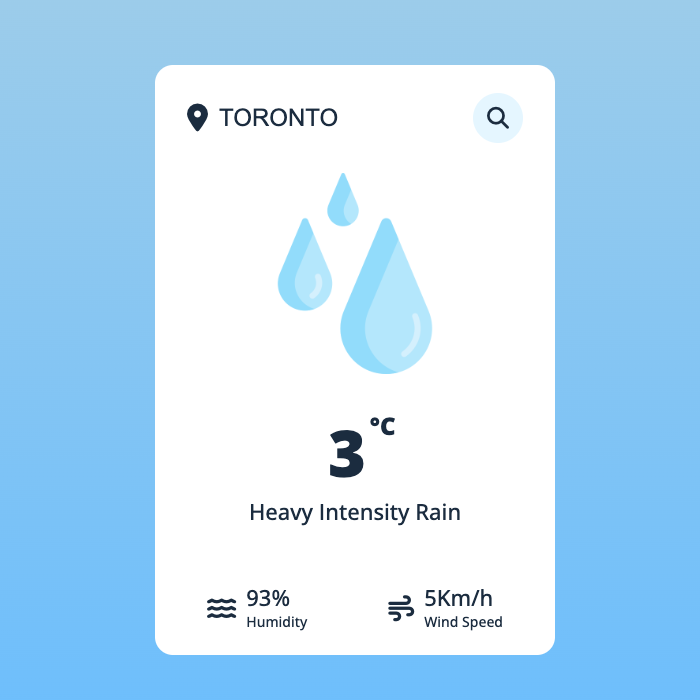

# Realtime Weather Application

## Table of Contents

- [Description](#description)
- [Preview](#preview)
- [Usage](#usage)
- [Tools Used](#tools-used)
- [Note](#note)
- [Deployment](#deployment)
- [Resources](#resources)

## Description

This app is designed for weather forecasting, offering the most up-to-date weather data for both your current location and any location you specify. It was created using JavaScript, CSS, and an API to fetch weather details.

## Preview



## Usage

1. Open the application in your browser.
2. Type in desired location.
3. View details about current forecast, humidity and wind speed.

## Tools used
- JavaScript: Programming language used to build the App.
- CSS: Style the visual appearance of the App.
- Open Weather API: Retrieve weather information to display in the App.

## Note

You need to get your own API Key from OpenWeather and replace it in index.js file on line 9. 

```javascript
const APIKey = 'Api Key';
```

## Deployment

Access the live application at: [https://raihanali29.github.io/weather-app](https://raihanali29.github.io/weather-app/)

GitHub Repository: [https://github.com/raihanali29/weather-app](https://github.com/raihanali29/weather-app)


## Resources

- [Weather API](https://openweathermap.org/api)

- [ASMR Programming - Weather App With Javascript](https://www.youtube.com/watch?v=iILFBGm_I9M)


